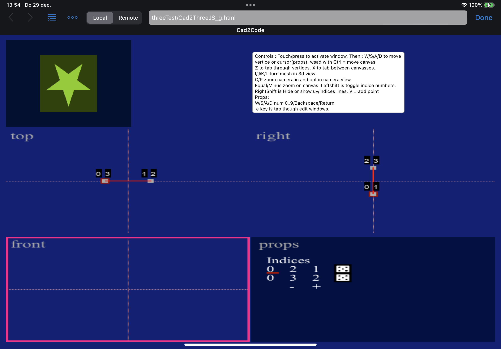

Work in progress. Minimally functional right now for touch and keyboard.
  
The idea was to create a modeler that makes copy pastable code for coding projects(three.js / javascript) Maybe also complete html pages showing the work you made in the editor(bare bones).
 
touch - (multi)select / move canvas / activate view. 
keyboard instructions on the screen. 
add modify move vertices and uvs. 
 
  
