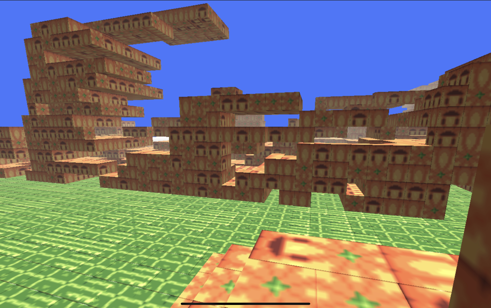

  
 
(book23.html version / touch control / first person camera / voxels / Minecraft / camera vs map collision / gravity / walking)
  
Current controls touch : touch center = move forward, touch left bottom = move backwards, double tap center bottom = jump,
elsewhere touch and drag = rotate camera. touch+hold then release to break block 
  
<a href="https://cromdesi.home.xs4all.nl/html5/voxelthing/">Play run test here(touchscreen)</a>  
the thee.min.js is a old version. 
the three.js is new <11-2022  
 
trying to figure out the things needed to code a voxel minecraft type game. 

boxes, chunks, atlasses, worlds, collision, controls, ... 
 
Book = Notes: 
I'm getting to know how to use tree.js using tutorials and forum and a book. 
Learning how to create a voxel world. Building from a 3d scene and
getting a chunk system working. My ipad has no multi core support in
the editors. So the world generation wil not be fast. 
The chunks are made up from cubes. Each cube is made from a quad. Each
quad has a texture from a atlas. Each cube can have its face turned on or
off. This allows it to save on memory and gpu/cpu. 
When two cubes are set side by side. The sides that touch have the
faces they share not be generated. 
A chunck is a sort of block of blocks. A world is made from a series
of chunks. The collision would(i think) be done by shooting a bullet from
the camera. The position divided by the cell w/h/d and if occupied in the array
means collide and remove/work/place. 
I have done loads of map generators over the years. These wil show up in the
series 
Touch and keyboard and maybe controller support(ipad).
  
book1 = plane cube camera spotlight 
book2 = plane cube shadow rotation 
book3 = plane cube spotlight rotation fog shadow 
book4 = create a mesh from points. 
book5 = group 2 cubes, each cube of different color. 
book9 = create buffer geometry and load texture and set uv mapping 
book10 = create a buffer geometry quad and texture it with a atlas texture. 
book11 = create multiple box front faces as a single buffer mesh and use texture atlas. 
book12 = create multiple box front faces in a grid as a single buffer mesh using random texture per quad. 
book13 = create a quad face for each side of a cube, one single mesh, each face a texture from a atlas. 
book14 = create a mesh from a series of cubes with atlassed textured faces(random texture) - Functionised 
book15 = chunck world block simple height map(texture/atlas) and remove block with touch(x,y screen position ray 
book16 = chunk with light. 
book17 = chunks to world. lighted world and fog. 
book18 = test with chunk and raycasting hud. (ray.at) 
book19 = Hud using a secondary camera and viewport clipping. 
book21 = World with camera keyboard control and buggy? touch controls. 
book22 - World with camera fpsfly control and collision camera/world. 
book23 - World with camera fps with basic gravity and map collision and minecraft ios touch control first person??buggy 
BOOK25 - World with camera fps jumping backwards map collision touch-controls 
book26 - Flower mesh build. small 
book27 - Grass flower plants large map test 
book28 - MAIN engine with plants 
book29 - MAIN engine with tunnel test and modified fps camera. 
book30 - MAIN engine with block remove (needs user controls remake) 
book31 - MAIN - engine with block highlighting. Delay for digging(long hold then release) 
book32 - MAIN - engine. Continue digging/placing when finger stays down. (dig/place distance now 500) !dig and place block 
book33 - Billboard / Canvasses on top of 3d view as user interface(ui) example. 
book34 - MAIN - engine - Changed camera movement drag and turn. Forward. 
book35 - MAIN - engine - Multi touch - move and turn (!) 
book36 - import json scenes. from https://threejs.org/editor/ Using to create game models and characters. models folder. 
book37 - import json scenes and find body part and rotate this independantly inside the combined scene mesh.  
book38 - import json scene as a character and trying to animate it throught the code. 
book39 - chunk example with changing texture from atlas on cube inside chunk in realtime.(fast) 
book40 - chunk example with changing texture in cube from atlas with light levels using vertexcolors. 2 in this example. Each face of each cube settable 
book41 - main - testing out hide remove show chunks based on distance - precursor to generator. 
book42 - main - genererate new chunks around player(unoptimized) hide/show distance and no destroy. 

