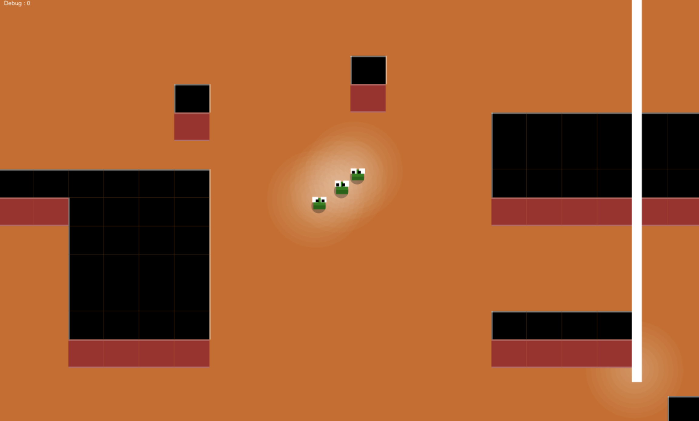

 
A little dungeon with slimy monsters. They teleport down and path their way to the center of the map. This is done with a flood fill path finding method. When close to the destination they go in a direct line. 
The slimes are animated. Their eyes move into their moving direction. Their posture goes up and down. 
There is a light source beneath each slime. This is drawn on the ground level before the map objects are drawn. 
 
Not tested on slow devices yet. 
Not edited to handle portrait <> landscape mode changes yet. 

  
 
