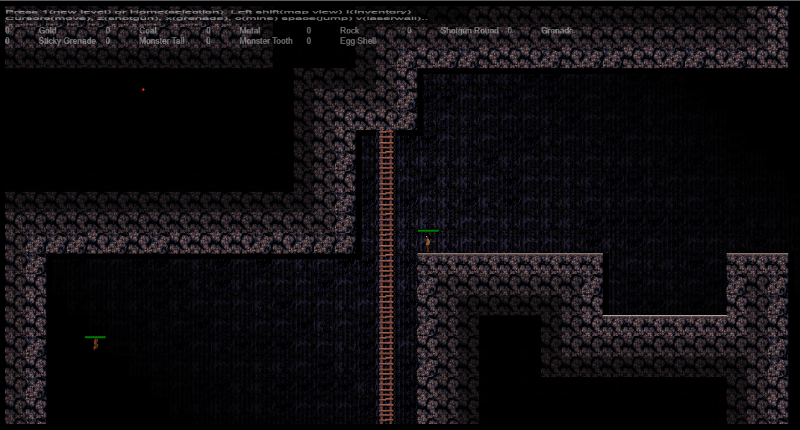

 
# Mine, Slime and Monsters
*Head down a mine and mine minerals and valuables dropped by the monsters that live and grow in the mine.* 
*Ported from my Monkey2 repo. Adding features and gfx. Now playable with Controller.*
  
Play current versionin browser - controller / keyboard / touch . 
https://cromdesi.home.xs4all.nl/html5/MineSlimeMonsters/
  

* Version :
* Added cheap light flood fill(BF - globalAlpha map) on the background tiles starting from player location.
* Added touch screen controls (layout..form..gfx..testing needed)
* bugsbugsbugs

  
 
*(sketch for the walking egg monsters. Wil get scarier and colored after tweaking)*
 
 
 
Conversion project from my Monkey 2 game 'Mine Slime and Monsters'..
     
 Old Version : (Emscripten) 
</img> 
[Play game in browser - old / keyboard only -](https://cromdesi.home.xs4all.nl/emscripten/monstermineslime/Untitled1.html)
  

Rescue Mission : (One at start of mission)
rescue villagers (mission?) - name:'Joe' has not got back from the mine yesterday. Could you go find him and bring him back? - 
Path finding through flood fill path finding. npc follows player. Jump on ladder. Jump on off heights. Once up the mine shaft
mission is completed. 
Collide with slime (death) 
Collide with monster (death) 
self defense (shotgun at slime and monsters and eggs - slow shot) 
No roam but waiting somewhere. 
Text message system. 
Player can not shoot or harm villager 
Death message(drop down message system 

   
**Ideas :**
* Replay - When you die the last few seconds are replayed showing how you died(zoomed in)
* Scientist say matter can form out of nothingness. Taking this a notch further, "the spawning of devil eggs".
* infinite sized maps? (Keep mining - save/load chunks)
* Shops to sell loot and buy loads of ammo and guns and equipment.
* Radio controlled drones. Machine gun drone and Explosive drone and flame thrower drone.
* flame thrower..
* Talk to villagers.
* Lighting system?
* Ladder rider - tool for going up and down ladders faster (store:levels)
* tile (globalAlpha) light fill around play to add some mood and eye candy

  
**Adding Features later on/bugs :**
* Touch screen controls(touch the screen and it displays a sliding menu to activate touch controls.)
* Fix up slime tiles. Bottom floor is unused. player can go through slime(?) Round edges(auto tiling)
* Create start position at slime location.
* Copy selected map from selection to game (new map)
* Walker ai walks backwards sometimes

