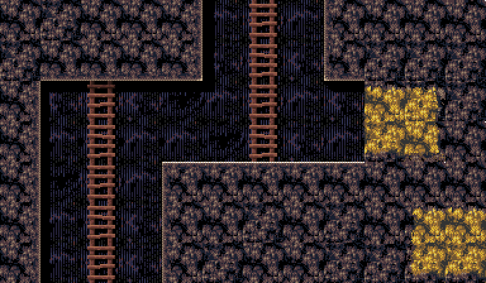

# Mine Slime and Monsters
  
*Head down a mine and mine minerals and valuables dropped by the monsters that live and grow in the mine.*
    
Ported from my Monkey2 repo. Adding features and gfx. Now playable with Controller.

  

 
*(sketch for the walking egg monsters. Wil get scarier and colored after tweaking)*

 
*(some of the level graphics that wil be used in the early version..)*

 
 
 
Conversion project from my Monkey 2 game 'Mine Slime and Monsters'..
 
When it gets around 5000 lines it should be close to converted.
 
 
I was planning on creating (more)gfx for the game and adding features and cleaning it up a bit..
 
    
 Old Version : (Emscripten) 
</img> 
[Play game in browser - old / keyboard only -](https://cromdesi.home.xs4all.nl/emscripten/monstermineslime/Untitled1.html)
  

Play NEW game in browser - controller / keyboard only  
https://cromdesi.home.xs4all.nl/html5/MineSlimeMonsters/

  

   
**Ideas :**
* Replay - When you die the last few seconds are replayed showing how you died(zoomed in)
* Scientist say matter can form out of nothingness. Taking this a notch further, "the spawning of devil eggs".
* infinite sized maps? (Keep mining - save/load chunks)
* Shops to sell loot and buy loads of ammo and guns and equipment.
* Radio controlled drones. Machine gun drone and Explosive drone and flame thrower drone.
* flame thrower..
* Talk to villagers.
* rescue villagers (mission?)
* Lighting system?
* Ladder rider - tool for going up and down ladders faster (store:levels)

  
**Adding Features later on :**
* Controller(xbox)
* Touch screen controls(touch the screen and it displays a sliding menu to activate touch controls.)
