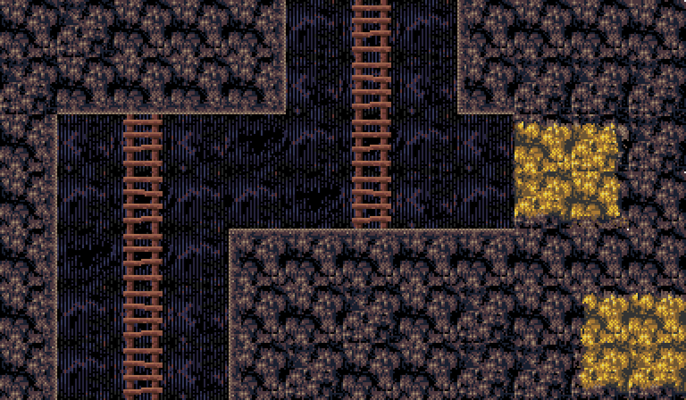

# Porting code : 3279 of 5000.
*(Monkey2 to Javascript)*
 Working on gfx(see below) and slight hand injury break from the typing.. 

  

 
*(sketch for the walking egg monsters. Wil get scarier and colored after tweaking)*

 
*(some of the level graphics that wil be used in the early version..)*

 
 
 
Conversion project from my Monkey 2 game 'Mine Slime and Monsters'..
 
When it gets around 5000 lines it should be close to converted.
 
 
I was planning on creating (more)gfx for the game and adding features and cleaning it up a bit..
 
    
 Old Version : (Emscripten) 
</img> 
[Play game in browser - old / keyboard only -](https://cromdesi.home.xs4all.nl/emscripten/monstermineslime/Untitled1.html)
  

**Conversion notes :**
* Added new controller code system. Should make joypad and touch control easier.
* Figure out what to do with resolution / window size changes.(pauze/rebuild?)
* Still struggling with offscreen canvasses.
* Need to fix a memory leak from old version.
* Variables Ints in array -> pay attention. (fix : Math.floor(variable) ) - note - Look at wrong use of this. - look at random(x,y)

   
**Ideas :**
* Scientist say matter can form out of nothingness. Taking this a notch further, "the spawning of devil eggs".
* infinite sized maps? (Keep mining - save/load chunks)
* Shops to sell loot and buy loads of ammo and guns and equipment.
* Radio controlled drones. Machine gun drone and Explosive drone and flame thrower drone.
* flame thrower..
* Talk to villagers.
* rescue villagers (mission?)
* Lighting system?
* Ladder rider - tool for going up and down ladders faster (store:levels)

  
**Adding Features later on :**
* Controller(xbox)
* Touch screen controls(touch the screen and it displays a sliding menu to activate touch controls.)
