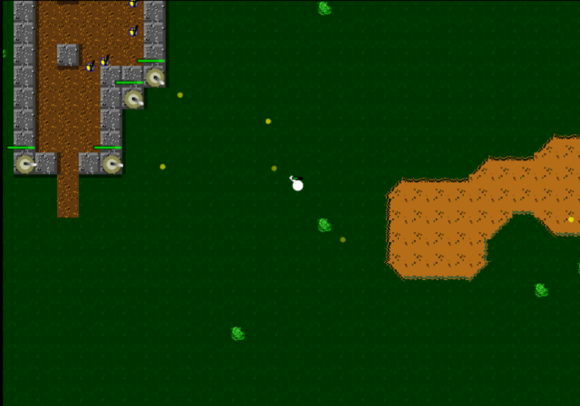

Porting from Monkey 2 to Javascript.
 
 
 
Slightly based on a old game from the 16 bit Amiga computer called 'fire power'
 
+ Create gfx (tiles and sprites)
+ Convert code to javascript
+ Upgrade map generator
+ Controller support
+ Phone/tablet/desktop keyboard and touchscreen controls.
 
 
<a href = "https://cromdesi.home.xs4all.nl/emscripten/tinytank/Untitled1.html">Play/test (Monkey2) webversion</a>
