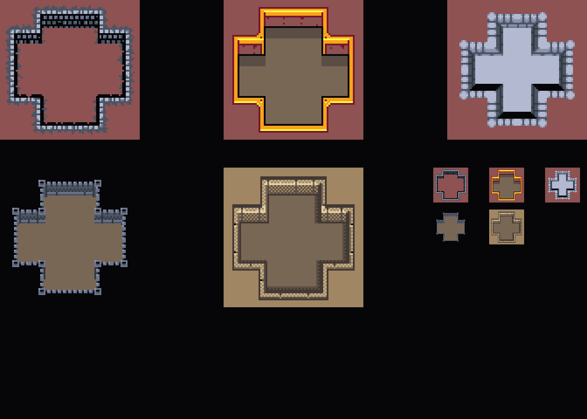

Use these gfx for your experiments and prototypes. Drawn by me.  

I have created examples here that have a base64 string containing gfx. These strings are loaded into a image.src. These can be drawn on the canvas. The drawImage command has some features that allows it to draw a rectangle from its image to be drawn. See online docs or examples from this repo to see how this is done. 

  
 
 

 
New technologies like Dall e 2 and others can generate gfx by feeding it a context(a short description). It is stil new tech and does not generate complete useable sprites and tiles yet. But in a few years you might be able to create any kind of sprite or tile set in a app or browser. 
On sites like 'open game art' or stores like those from Unity or itch.io you can buy or even get free game assets for creating games. 
