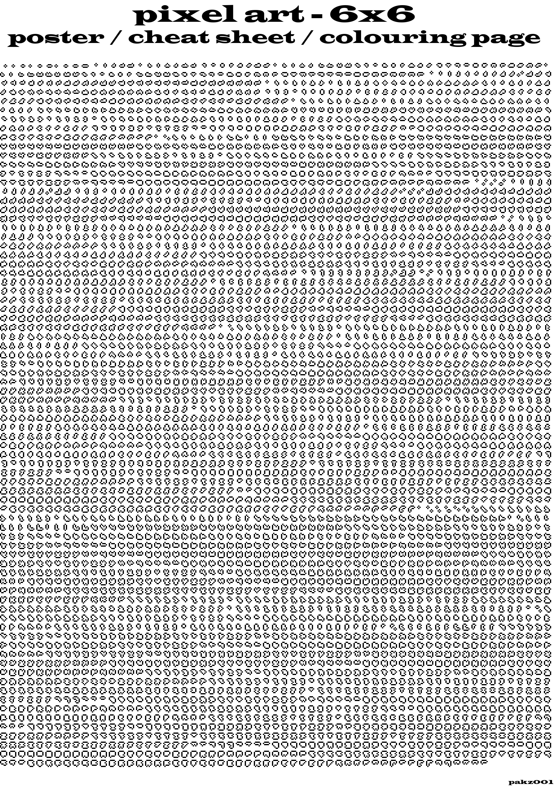

   
This is the output of the 6x6 binary filter into 1 bit pixel art outline shapes. Took 24 hours on my Celeron N1 mini pc. I turned the output canvas with the shapes into a black and white poster using a external tool. Uses are coloring, practice drill, reference, further (generative) touch up.
  
update : 
while the programs were running for a couple of days I had been sometimes looking and thinking how to improve. sometimes new ideas just come like that. I added a masking editor. red block for skip, and green block for required. the binary addition is not modded yet to fit into the open cells and stil occupy the red cells. they are not entering the filtering process. i also changed the binary function to use a regular multidimensional array and not have it be translated from string to array every pass.<<bt>
a pauze button was added and also a reset button. futher interface mods are expected. thinking of turning it into amkind of video game like screen where scientists of factory workers create designs or products. the output being the outline pixel art. these could be further turned into more complete pixel art. this by adding some color fills and shading. thinking of the video game armour geddon from the amiga days(90's) for ideas on how to make the browser window look. 
currently testing and modyfing the new versions on 2 low powered intel n100 minimpc's. 
