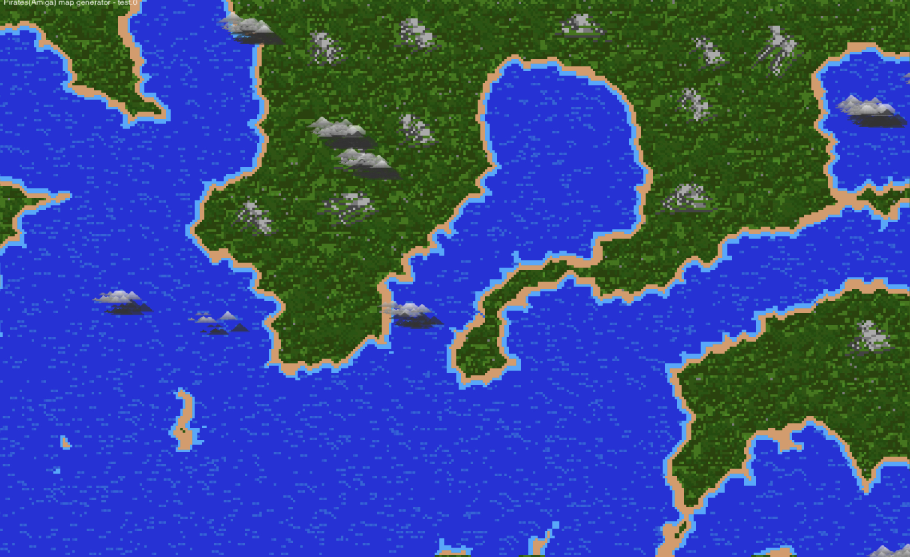

 
The map below is made up all of programmed graphics. The game it is based on is called 'Castles 2'
from the Amiga Home Computer. (castle MAIN file)
   

 
pirates Amiga trees try 4 turned into a 'complete' remake of the world map. The screen where you sail your ship across the world. The generator has been tested of fairly large map sizes. There is no boat currently. There are clouds that float across the world. Everything is generated with code. 

