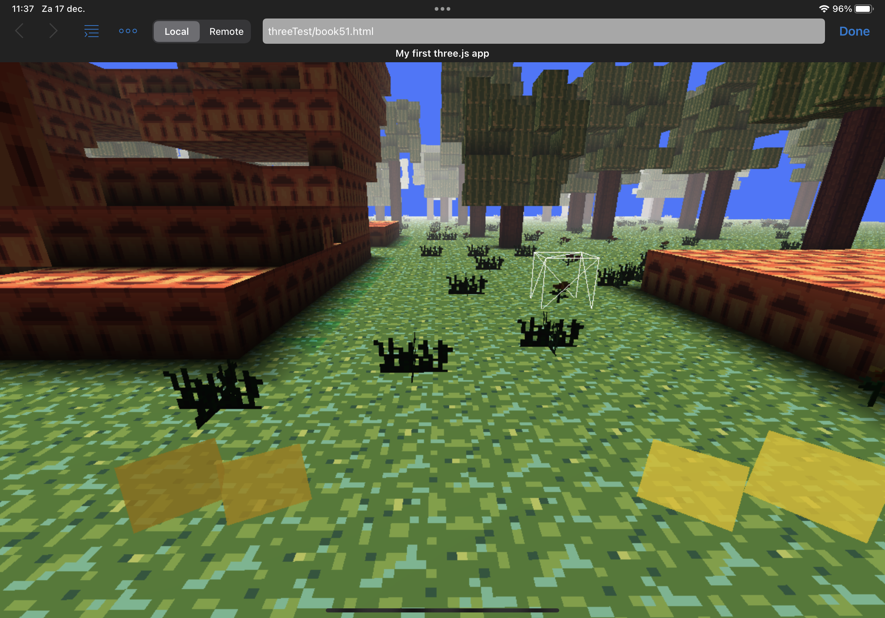
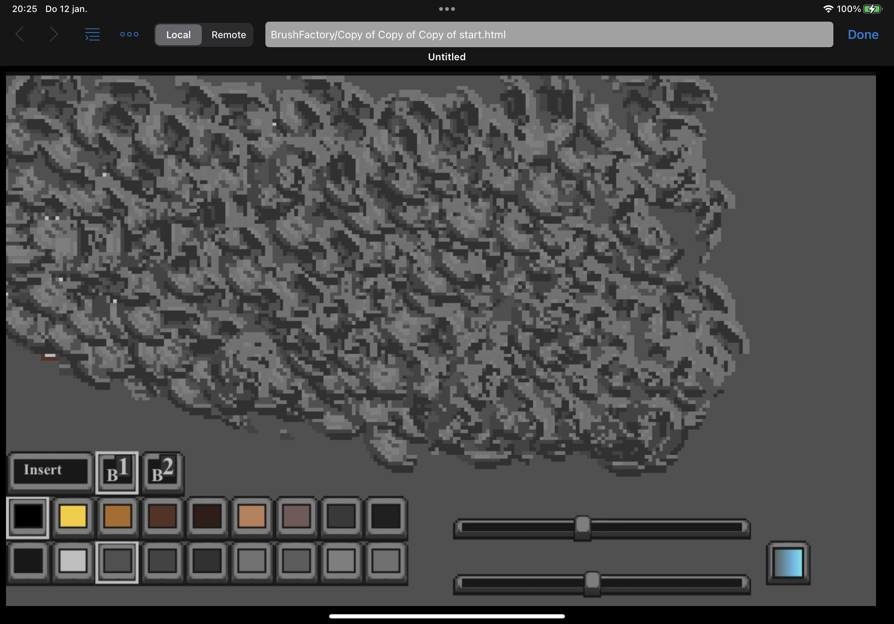
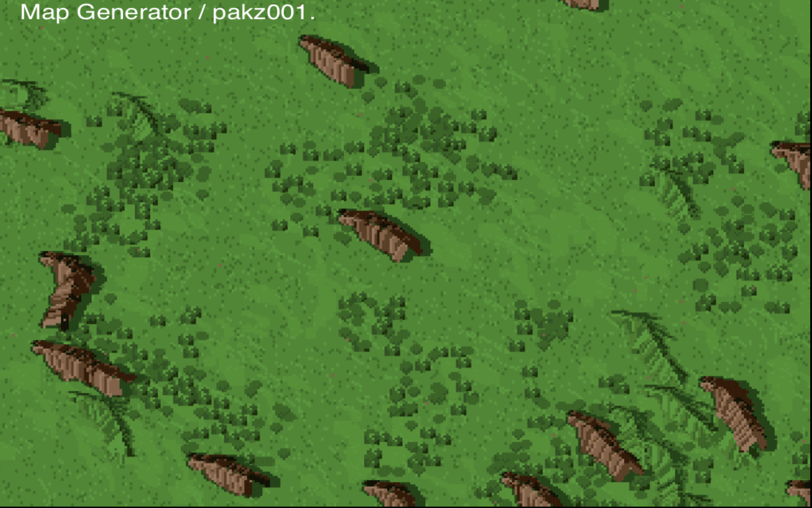
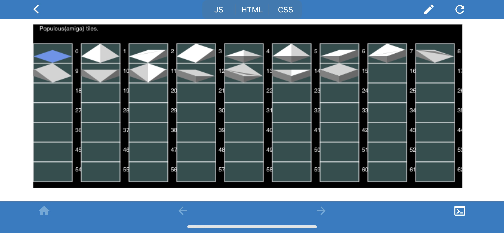

<h3>html5 javascript game oriented example code. ( Learn to code games by studying examples ) </h3>  

the voxel engine is in folder 3d/threetest/test/  

  
 Link: 
<a href="https://cromdesi.home.xs4all.nl/html5examples/">Visit the repo site - run and view examples - update december</a> 
 

update:checked every file and removed references to a unused css file. gfx now included by base64(toDataUrl())

(Gamedev) - Snippets / templates / functions / prototypes

  From the 3d / threetest / test - folder. 
(tablet / phone Browser Touch voxel engine)(book files chapter 1..x) 
  
Tools/BrushFactory. 
  

Copy paste (edit) and run. ( each html file is stand alone and requires no clunky installing. just open it with a browser )
(three.js requires more work. media and .js includes and later worker threading files (3d))

 From the procgen folder:(100% programmed graphics - random maps) 
 

  
 
(Populous Amiga tiles made with moveTo lineTo commands)
  

 
<a href="https://www.programming-helper.com/">Link: Ai code generator(free(reg) and javascript)</a> 
 
Link to free online and downloadable study book : https://eloquentjavascript.net/ ( option to buy )
 Rex van der Spuy also has some good books.  
(Further references : Javascript the definitive guide(7th), build your own 2d game engine and create web games)
  
Dotate to author of this code repo. (Insert coin for book fund and productivity aim) https://www.paypal.me/RudyvanEtten/1

interesting yt video's/tutorials :   
making a fighting game javascript canvas (3hrs) 
https://youtu.be/vyqbNFMDRGQ 
