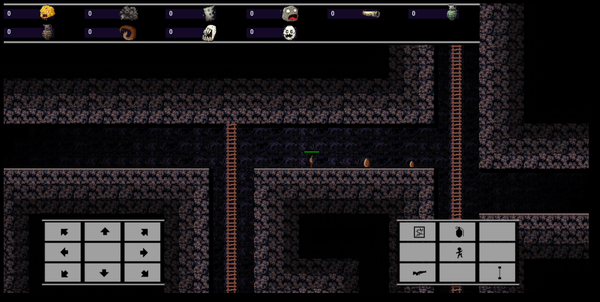
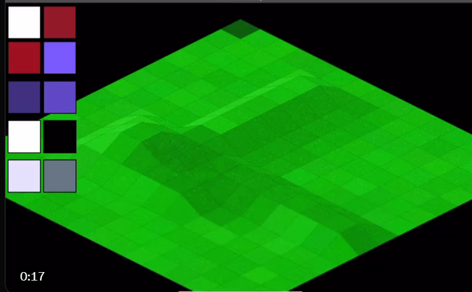

# html5 javascript game oriented example code. 

  
 Link: 
<a href="https://cromdesi.home.xs4all.nl/html5examples/">Visit this repo's website - run and view examples - updated last december</a> 
 
(Gamedev) - Snippets / templates / functions / prototypes
  
 
(tablet / phone Browser Touch voxel engine)(book files chapter 1..x) 
</img> 
*(In the '3d/threetest/test' folder.)*
 
 
Tools/BrushFactory. - phone(landscape/portait mode) - tablet (portrait/landscape mode)
</img> 
*(In the tools folder.)*
 
 

</img> 
*( screenshot of current version (games folder in this repo / has link to playable version on my site..)*

  
</img> 
*(Populous Amiga tiles made with moveTo lineTo commands)*
   
Dotate to author of this code repo. (Insert coin for book fund and productivity aim) <a href="https://www.paypal.me/RudyvanEtten/1">Donate on paypal</a>
 
