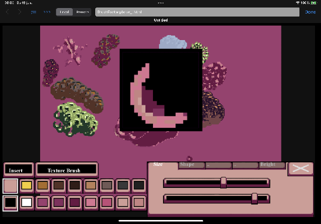
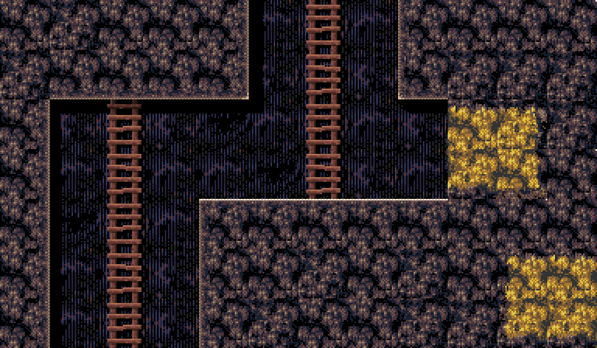

# html5 javascript game oriented example code. 
## ( Learn to code games by studying examples )

  
 Link: 
<a href="https://cromdesi.home.xs4all.nl/html5examples/">Visit the repo site - run and view examples - update december</a> 
 

(Gamedev) - Snippets / templates / functions / prototypes

  
(tablet / phone Browser Touch voxel engine)(book files chapter 1..x) 
</img> 
*(In the '3d/threetest/test' folder.)*
 
 
 Voxel Game Progress video - Youtube link below-- 

 
 
Tools/BrushFactory. - phone(landscape/portait mode) - tablet (portrait/landscape mode)
</img> 
*(In the tools folder.)*
 
 

</img> 
*(some of the level graphics of 'Mine Slime and Monsters' (games folder) that wil be used in the early version..)*

  
</img> 
*(Populous Amiga tiles made with moveTo lineTo commands)*
 
Dotate to author of this code repo. (Insert coin for book fund and productivity aim) https://www.paypal.me/RudyvanEtten/1
 
