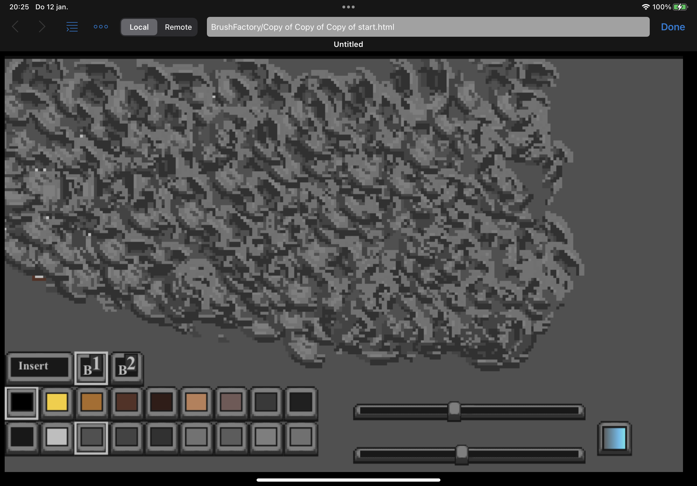

 
Each file right now is a stand alone app. Download and run with a browser. Or copy out the text from one of these files here in the github repo in this browser and put it in a empty text file and save it with the .html extention. Then open it with a browser. Maybe it can also be pasted into a webpage online that runs html code.(learn html sites or codepen things  The tool here requires a touch device at the moment. No mouse or keyboard support. I might buy a apple pencil(gen 2) and start modifying the app to use features from that.  
I am coding this app with Textastic(app store) on a ipad pro. 
 
prototypes, samples, experiments of a 2d pixel editing tool(sprite editor paint tool)
  
trying to create and learn to create specialized paint brushes. 
initial idea, create a pixel art brush that has height. angle/edge/higlight/shade/move speed/slow add details. 
  
notes: 
*figure out smear logic. 
*overwrite and insert mode button 
 
Ideas: 
*Brushes per image element category. Tree Branch brush: Tree Stump Brush: Leaf Brush: Grass Brush: Water Brush: (Pixel art referenced constructed)  
 

*lock anchor. touch position brush tip is aimed* rotated at anchor. this for tunnel like effects. note: make brush tios x 

*add alias brush. read area and place pixels 

*undo 

*cls 

*random level generator for drawing on top off. sort of paint by numbers. maze generators top down land masses. random inspiration idea button 

*Blob brushes - Use shapes other than round and square - generate a random* single blob of x,y size. The edges are read as a array for the brush logic to use. 

*pixel art tree/bush brush. Draw from the center out. reference: down black edges and darker inside. Up lighter edges and slightly darker smudge(leaf). angle ui / color range ui. / detailing level ui. 

*a brush where edges up and down are shaded. left and right are lighter and darker. (find reference 

  
AngleEdgeColorRampBrush_x.html
 

 
 
 
